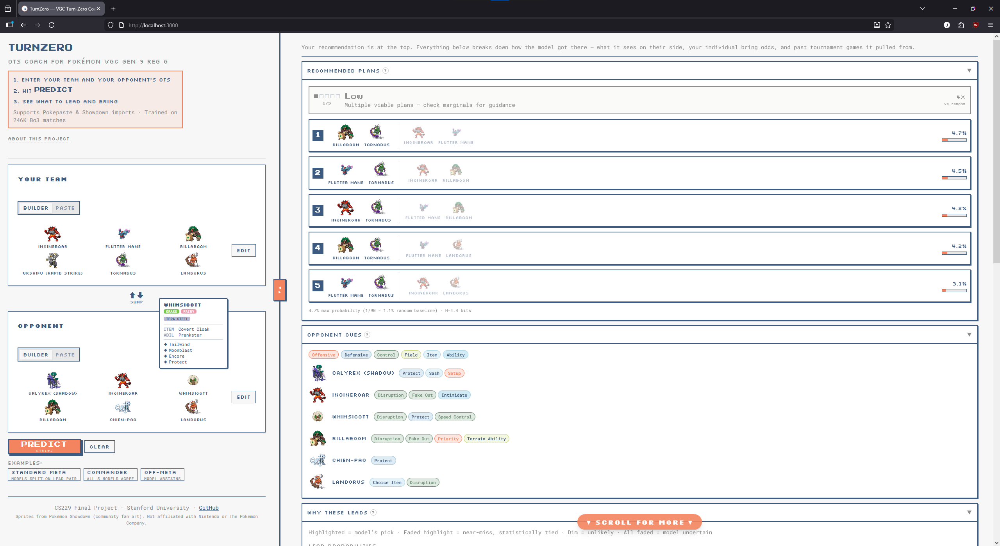

# TurnZero

**The Illusion of Adaptation When Experts Lose**

Lucas Brennan-Almaraz · Stanford CS229 · Winter 2025--26

[[Paper (PDF)]](paper/turnzero.pdf) · [[Dataset (HuggingFace)]](https://huggingface.co/datasets/cameronangliss/vgc-battle-logs) · 

<p align="center">
  <a href="https://turnzero.vercel.app">
    
  </a>
  <br/>
  <sub>no install · runs in your browser</sub>
</p>

---

In best-of-three Pokémon VGC tournament play, players who just lost change their lead pair far more often than winners (72% vs 46%). This looks like adaptation, but it isn't: the exploration is undirected and produces no learnable structure.

We show this using permutation-invariant transformer ensembles as measurement instruments on 382K expert replays. A sequential model conditioned on prior-game outcome gains +6.6pp after wins (players repeat what worked) but less than 1pp after losses. A specialist trained only on post-loss data scores *below* the base ensemble on that same subset (4.0% vs 5.4%), meaning the post-loss signal actively misleads; and 87% of post-loss lead changes don't even interact with the opponent's prior leads.

**See also:** [TurnOne](https://github.com/leba01/turnone) looks at turn-1 actions. SVD of the payoff matrices reveals effective rank 3 out of ~122 actions, meaning convention is free because most of the action space is payoff-irrelevant. Same dataset, same format, different question.

## What we found

Winners stay, losers explore. Across 136K game-to-game transitions, players who just won change leads 46% of the time; those who just lost change 72% (χ² = 10,126). After winning, 91% of transitions stay on the diagonal with conditional entropy H = 0.52 nats. After losing, diagonal concentration drops to 77% and entropy nearly doubles to H = 1.02 nats. Stronger players change less overall, but the ~27pp gap between post-loss and post-win change rates holds across all Elo tiers.

The exploration is unstructured. Among post-loss changers, 87% of lead switches don't change the overlap with the opponent's prior leads at all. Of the 13% that do, switching toward and switching away from the opponent produce identical game-2 win rates (54.8% vs 54.9%). Losers are scrambling, not counter-adapting.

The base model learns convention, not strategy. Removing the opponent's team at inference costs only -1.3pp (6.4% → 5.1%); removing the player's own team collapses accuracy to random. Per-archetype accuracy correlates with action entropy (r = -0.56, strengthening to r = -0.77 for well-sampled archetypes). Commander teams hit 50% top-1 because the rules force a specific lead; flexible "goodstuffs" teams hit 0%.

A sequential model conditioned on prior outcome confirms the asymmetry: +6.6pp after wins (6.4% → 13.0%) but only +0.8pp after losses (5.4% → 6.2%). A post-loss specialist trained exclusively on post-loss data does *worse* than the base model on its own target subset (4.0% vs 5.4%). Adding the opponent's revealed game-1 species as context adds nothing. There is no learnable structure in post-loss adaptation.

## Results

Top-1 accuracy (%) on the 90-way lead prediction task, stratified by prior-game outcome. Games 2-3 only (Tier 1, n = 32,328).

| Model | Params | After win | After loss | G2-3 |
|:---|---:|:---:|:---:|:---:|
| Base ensemble | 5.8M | 6.4 | 5.4 | 5.9 |
| Sequential | +2.8K | **13.0** | 6.2 | **9.4** |
| + Opp. context | +4.1K | 12.6 | 6.0 | 9.2 |
| Post-win specialist | +2.8K | 10.1 | 3.9 | -- |
| Post-loss specialist | +2.8K | 7.0 | 4.0 | -- |

Sequential gains come entirely from post-win repetition. The post-loss specialist performs *worse* than the base model on its own target data (4.0% vs 5.4%).

## Method

Each of 12 Pokémon is tokenized as the sum of 8 learned embeddings (species, item, ability, tera type, 4 moves) and processed by a 4-layer transformer encoder (d=128, H=4). Tokens are canonically sorted and aggregated via mean pooling with no positional encoding, avoiding the [positional leakage](https://github.com/hspokemon/EliteFurretAI) that inflated prior work from 99.9% to 79%. A 5-member deep ensemble averages probabilities across independently trained members (5.8M total parameters).

The sequential variant prepends a single context token encoding game number, prior result (win/loss/none), and the prior lead pair index. This adds only 2,816 parameters (<0.3% of the base model). Game-1 examples get sentinel values, so the context introduces no phantom signal.

Split design: teams clustered by species overlap (≥4/6 → union-find connected components). Regime A holds out team variants within clusters (in-distribution). Both directed examples from each game stay in the same split. 212K BO3 tournament battles yield 382K directed examples; 53K linkable sets produce 136K game-to-game transitions for adaptation analysis.

## Demo

The web demo runs the full 5-member ensemble client-side via ONNX Runtime. No backend, no data leaves your browser. Paste two team sheets and get calibrated predictions with uncertainty estimates, role annotations, feature sensitivity, and retrieval evidence from similar historical matchups.

<p align="center">
  <a href="https://turnzero.vercel.app">
    
  </a>
</p>

<p align="center">
  <a href="https://turnzero.vercel.app">turnzero.vercel.app</a>
</p>

## Paper figures

| Figure | What it shows |
|:---|:---|
| `transition_heatmaps` | Lead-pair transition matrices: post-win (91% diagonal, H=0.52) vs post-loss (77% diagonal, H=1.02) |
| `cluster_entropy_vs_accuracy` | Per-archetype accuracy vs action entropy (r = -0.56, r = -0.77 at n ≥ 50) |
| `subset_model_comparison` | Post-win specialist captures signal (10.1%); post-loss specialist falls below base (4.0% vs 5.4%) |

## Future work

Other VGC regulations, with different restricted Pokémon pools, may shift the balance between convention and flexibility. Testing whether the adaptation asymmetry replicates there is the obvious next step.

Beyond Pokémon, any competitive domain with combinatorial team selection and best-of-N structure (MOBA drafting, fighting game counterpicks, sports lineup decisions) could show analogous patterns. A lab or simulation setting where lead choice can be randomized would let us ask the causal question our observational data can't: does post-loss adaptation actually help?

## Citation

```bibtex
@misc{brennan2026turnzero,
  title={TurnZero: The Illusion of Adaptation When Experts Lose},
  author={Brennan-Almaraz, Lucas},
  year={2026},
  note={Stanford CS229 Final Project, Winter 2025--26},
  url={https://github.com/leba01/turnzero}
}
```

This project uses the VGC-Bench dataset:

```bibtex
@inproceedings{angliss2026vgcbench,
  title={VGC-Bench: Evaluating and Advancing LLMs as Pokemon VGC Battling Agents},
  author={Angliss, Cameron and Luo, James and Wei, Xinpeng and Togelius, Julian},
  booktitle={AAMAS},
  year={2026}
}
```

---

<details>
<summary><strong>Reproducing the results</strong></summary>

### Setup

```bash
git clone https://github.com/leba01/turnzero.git
cd turnzero
python3.12 -m venv .venv
source .venv/bin/activate
pip install -e ".[dev]"
```

### Pipeline

Each stage reads the previous stage's output. Run in order:

```bash
# 1. Place raw battle logs in data/raw/ (from HuggingFace)

# 2. Parse Showdown protocol → directed match examples
turnzero parse --raw_path data/raw/logs-gen9vgc2025reggbo3.json \
               --out_dir data/parsed/gen9vgc2025reggbo3

# 3. Canonicalize names, sort, dedup
turnzero canonicalize --in_path data/parsed/match_examples.jsonl \
                      --out_dir data/canonical

# 4. Cluster teams (≥4/6 species overlap, union-find)
turnzero cluster --in_path data/canonical/match_examples.jsonl \
                 --out_dir data/clusters

# 5. Train/val/test splits (Regime A + B)
turnzero split --in_path data/canonical/match_examples.jsonl \
               --clusters data/clusters/cluster_assignments.json \
               --out_dir data/splits

# 6. Assemble per-split JSONL
turnzero assemble --canonical_path data/canonical/match_examples.jsonl \
                  --clusters data/clusters/cluster_assignments.json \
                  --splits data/splits/splits.json \
                  --out_dir data/assembled

# 7. Validate integrity
turnzero stats --data_dir data/assembled --validate
```

### Train

```bash
# Single model
turnzero train --config configs/transformer_base.yaml \
               --out_dir outputs/runs/run_001

# Full ensemble (5 members)
bash scripts/train_ensemble.sh

# All ablations (4 loss modes × 5 seeds)
bash scripts/train_ablations.sh
```

### Evaluate

```bash
turnzero eval --model_ckpt outputs/runs/run_001/best.pt \
              --test_split data/assembled/regime_a/test.jsonl \
              --out_dir outputs/eval/run_001
```

### Calibrate

```bash
turnzero calibrate --ensemble_dir outputs/runs \
                   --val_split data/assembled/regime_a/val.jsonl
```

### Coach demo

```bash
turnzero demo \
  --ensemble_dir outputs/runs \
  --team_a "Rillaboom,Flutter Mane,Incineroar,Urshifu,Farigiraf,Ogerpon" \
  --team_b "Tornadus,Rillaboom,Incineroar,Urshifu-Rapid-Strike,Flutter Mane,Landorus" \
  --index_path outputs/retrieval/train_index
```

### Tests

```bash
pytest  # 200 tests, ~2s
```

</details>

<details>
<summary><strong>Repository structure</strong></summary>

```
turnzero/
├── turnzero/                   # Main package
│   ├── action_space.py         # 90-way bijection: C(6,4)×C(4,2)
│   ├── schemas.py              # Pokémon, TeamSheet, MatchExample dataclasses
│   ├── cli.py                  # Click CLI (10 commands)
│   │
│   ├── data/                   # Data pipeline
│   │   ├── parser.py           #   |showteam| protocol extraction
│   │   ├── canonicalize.py     #   Name normalization, sort, dedup
│   │   ├── assemble.py         #   Attach splits + clusters → per-split JSONL
│   │   ├── dataset.py          #   PyTorch Dataset + Vocab
│   │   ├── sequential_dataset.py #  Extends VGCDataset with BO3 context
│   │   ├── bo3_context.py      #   BO3 sequential context builder
│   │   ├── stats.py            #   Integrity validation + dataset report
│   │   └── io_utils.py         #   JSONL streaming I/O
│   │
│   ├── splits/                 # Leakage-safe splitting
│   │   ├── cluster.py          #   Union-find core clustering (≥4/6 species)
│   │   └── split.py            #   Regime A (within-core) + Regime B (OOD)
│   │
│   ├── models/                 # Model zoo
│   │   ├── baselines.py        #   Popularity + multinomial logistic
│   │   ├── transformer.py      #   Permutation-equivariant set transformer
│   │   ├── hierarchical.py     #   Hierarchical dual encoder (ablation)
│   │   ├── sequential_transformer.py # BO3-conditioned transformer
│   │   └── train.py            #   Training loop (AdamW, mixed precision, compile)
│   │
│   ├── uq/                     # Uncertainty quantification
│   │   ├── ensemble.py         #   Deep ensemble inference + entropy/MI
│   │   └── temperature.py      #   Post-hoc temperature scaling (val only)
│   │
│   ├── eval/                   # Evaluation + paper figures
│   │   ├── metrics.py          #   NLL, Brier, ECE, top-k, stratified
│   │   ├── plots.py            #   Reliability diagrams, model comparison
│   │   ├── bootstrap.py        #   Cluster-aware bootstrap CIs (B=1000)
│   │   ├── risk_coverage.py    #   AURC + abstention operating points
│   │   └── robustness.py       #   Feature masking stress test
│   │
│   └── tool/                   # Coach demo
│       ├── coach.py            #   Full demo pipeline (top-k + abstain)
│       ├── explain.py          #   Marginals, sensitivity analysis
│       ├── lexicon.py          #   OTS role annotations (speed control, etc.)
│       └── retrieval.py        #   Cosine similarity over 246K train embeddings
│
├── configs/                    # Model configs (YAML)
├── scripts/                    # Analysis + export scripts
├── tests/                      # 200 tests
├── paper/                      # LaTeX source + compiled PDF + 15 figures
├── web/                        # Live demo (Next.js + ONNX, client-side inference)
├── data/                       # Data artifacts (not in git)
├── outputs/                    # Model outputs (not in git)
└── docs/                       # Documentation
    └── demo.png                #   Web demo screenshot
```

</details>

## License

MIT
